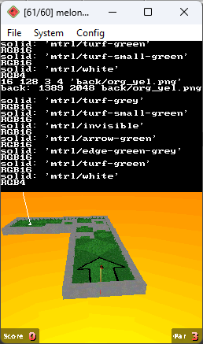

# neverball140-nds

Port of Neverball and Neverputt 1.4.0 to the Nintendo DS

Made with BlocksDS.

this port is mostly a proof-of-concept of sorts - the performance is poor while ingame (depending on the current level).
